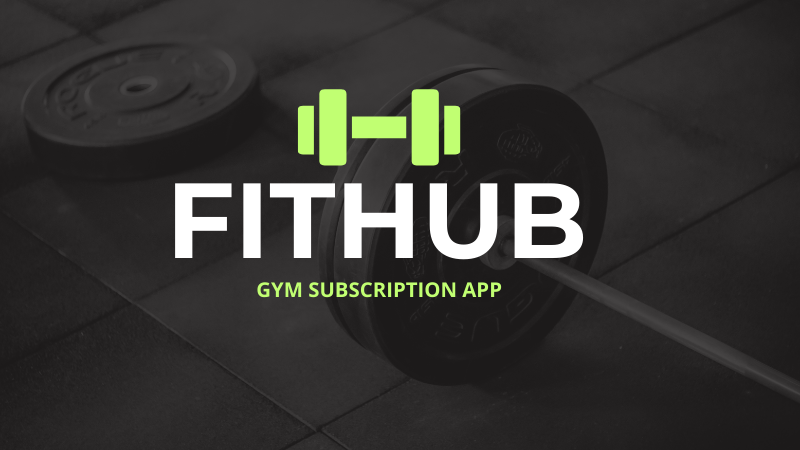
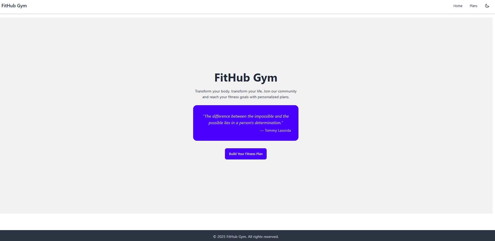
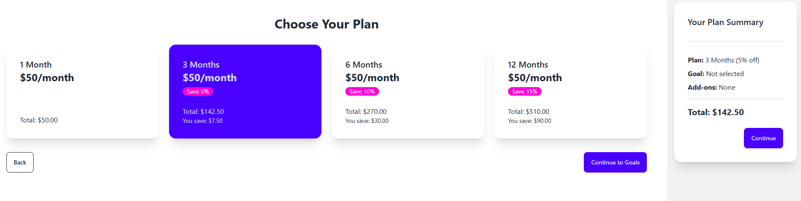
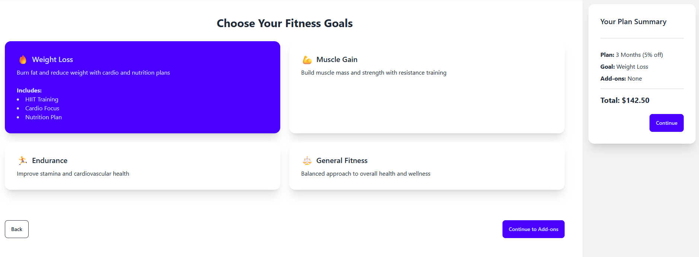
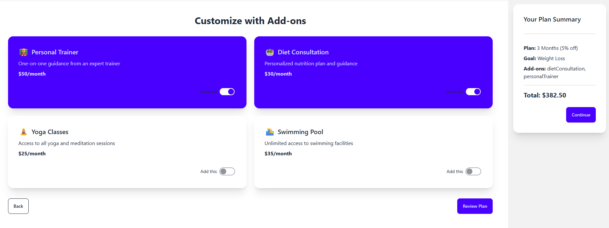
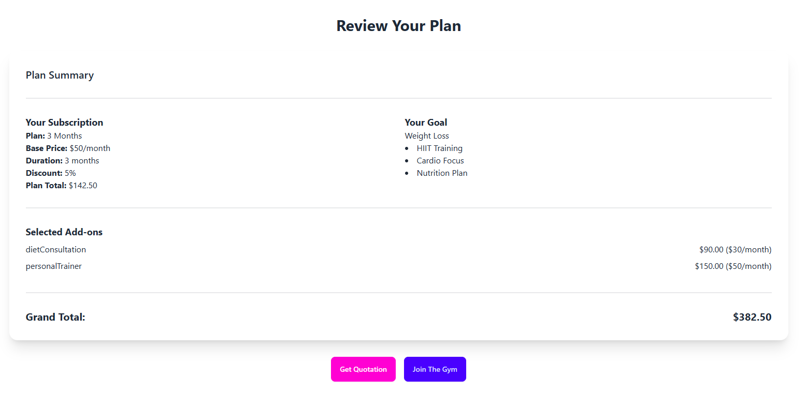
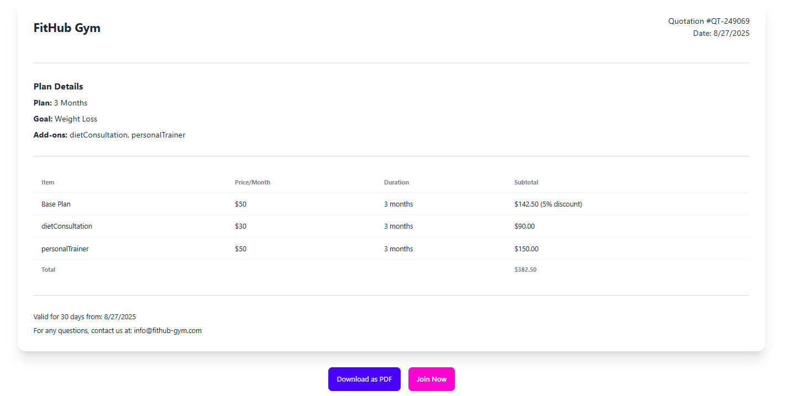
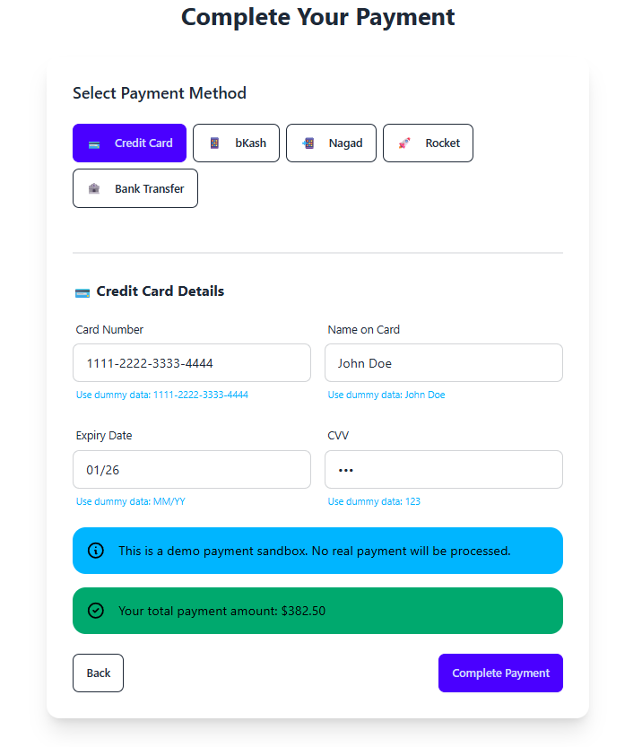

# FitHub Gym Subscription App



## Description

Developed a responsive Gym Subscription App with React 19, hooks, and context API. Features include plan selection with real-time pricing, motivational quotes, and PDF quotation generation. Implemented with DaisyUI styling and Framer Motion animations, creating a polished experience that demonstrates modern React patterns and responsive design.

## Features

- 🏋️ Interactive subscription plan selection with dynamic pricing
- 🎯 Fitness goal selection with visual feedback
- ➕ Add-ons selection for personalized plans
- 💰 Real-time pricing calculation and summary
- 📃 PDF quotation generation and download
- 📱 Fully responsive design for all devices
- 🌓 Dark/light theme toggle
- 💬 Motivational fitness quotes integration
- 🛒 Simulated payment gateway interface
- ⚡ Smooth animations and transitions

## Screenshots

## 📱 Responsive Design & Theme Modes

Our app is fully responsive and supports both light and dark themes for optimal user experience.

### Desktop View

#### Light Mode

*Desktop view of the landing page in light mode*

#### Dark Mode

*Desktop view of the landing page in dark mode*

### Mobile View

<div align="center">
  <table>
    <tr>
      <td align="center" width="200px">
        
        <br />
        <em>Mobile Light Mode</em>
      </td>
      <td align="center" width="200px">
        
        <br />
        <em>Mobile Dark Mode</em>
      </td>
    </tr>
  </table>
</div>

The application automatically adapts to different screen sizes while maintaining full functionality and visual appeal. Users can toggle between light and dark themes using the theme switch in the navigation bar.

### Landing Page

*Engaging landing page with motivational quotes to inspire users*

### Plan Selection

*Interactive subscription plan options with real-time pricing calculations*

### Goals Selection

*Fitness goal selection with responsive UI that highlights your choice*

### Add-Ons Selection

*Customizable add-ons to enhance your fitness journey*

### Plan Summary

*Comprehensive summary of selected plan, goals, and add-ons*

### Quotation

*Professional quotation with download as PDF functionality*

### Payment Interface

*Secure and intuitive payment simulation interface*

## How to Run the Project

### Prerequisites
- Node.js (v18.0.0 or higher)
- npm (v8.0.0 or higher)

### Installation

1. Clone the repository
```bash
git clone https://github.com/yourusername/fithub-gym-app.git
cd fithub-gym-app
```

2. Install dependencies
```bash
npm install
```

3. Start the development server
```bash
npm run dev
```

4. Open your browser and navigate to `http://localhost:5173`

## Build for Production

```bash
npm run build
```

The build files will be in the `dist` directory.

## Technologies Used

- React 19.1.1
- React Router 6
- Framer Motion (animations)
- DaisyUI & Tailwind CSS (styling)
- html2canvas & jsPDF (PDF generation)
- Vite (build tool)

## Dummy Payment Credentials

For testing the payment functionality, use the following credentials:

- **Credit Card**: 1111-2222-3333-4444, CVV: 123
- **bKash**: 01700000000, PIN: 1234
- **Nagad**: 01700000000, PIN: 1234

## License

This project is licensed under the MIT License - see the LICENSE file for details.

## Author

Your Name - [Your GitHub Profile](https://github.com/yourusername)

---

Feel free to star ⭐ this repository if you find it helpful!